# Digital Forensics Practical Report
## Steganography Analysis: Embedding, Extraction, and Password Recovery

---

## 1. Case Information

| Field | Details |
|-------|---------|
| **Case Number** | STEG-2026-001 |
| **Investigator** | Fasinu Temidayo |
| **Date of Analysis** | 5 September 2026 |
| **Lab** | ICDFA Laboratory |
| **Carrier Image** | `_tower_original_image_for_lab.bmp` |
| **Tools Used** | steghide, stegseek, xxd, strings, sha256sum |
| **Role** | Junior Digital Forensic Analyst |

---

## 2. Executive Summary

### 2.1 Investigation Overview

This investigation demonstrates steganography techniques for hiding and extracting data within image files. The lab explores LSB (least significant bit) substitution, embedding/extraction with Steghide, and password recovery using StegSeek — first with a lab-provided example, then repeated independently with a custom payload and password to confirm the method generalizes.

### 2.2 Key Findings

| Task | Result |
|------|--------|
| Carrier Image Hash Recorded | ✅ |
| Secret File Created | ✅ |
| Steghide Embedding | ✅ Success |
| Steghide Extraction | ✅ Success |
| File Integrity (Round 1) | ✅ Verified (hashes match) |
| Password Recovery (Round 1) | ✅ Success (`1234` found) |
| Independent Task (Round 2) | ✅ Success (custom note, custom password) |
| Password Recovery (Round 2) | ✅ Success (`temidayo` found) |

---

## 3. Understanding Steganography

### 3.1 Steganography vs Encryption

| Feature | Steganography | Encryption |
|---------|---------------|------------|
| Purpose | Hide existence of data | Scramble data |
| Visibility | Hidden from view | Visible as scrambled text |
| Detection | Difficult to detect | Obvious presence |
| Implementation | LSB substitution | Mathematical algorithms |

### 3.2 LSB Substitution Explained

**What is LSB?**

Each pixel in a 24-bit BMP has 3 color channels (R, G, B), each with 8 bits. The LSB is the rightmost bit.

**Example:**
```
Original: Red = 11111111 (255)
Modified: Red = 11111110 (254) - only the last bit changed
```
The human eye cannot detect the ±1 color difference.

**Why It Works:**
- Hides 1 bit per color channel (3 bits per pixel)
- Visual appearance remains virtually identical
- Requires 8 pixels to hide 1 byte of data
- Can hide large amounts of data in high-resolution images

---

## 4. Part A: Evidence Preparation

### 4.1 Environment Setup

**Command:**
```bash
mkdir ~/steganography_lab
cd ~/steganography_lab
mkdir original extracted screenshots wordlists
```

*Screenshot: working directory*
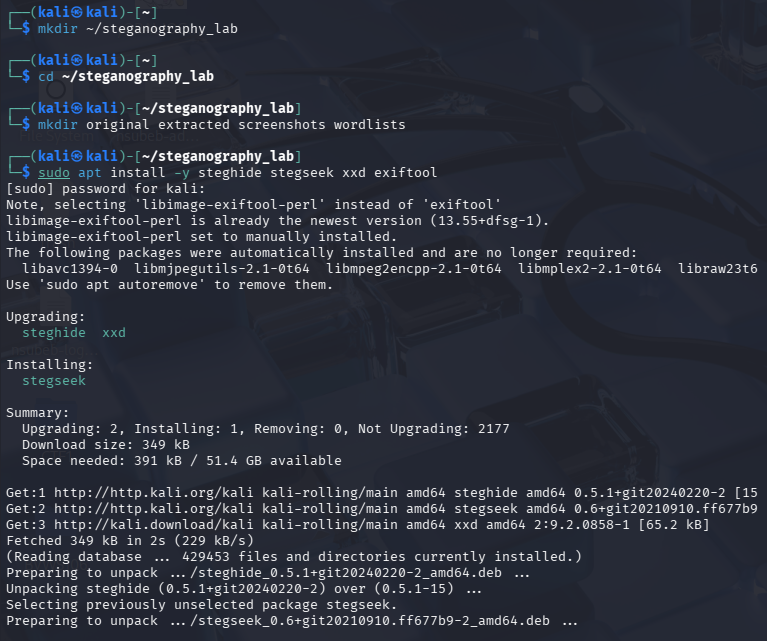

### 4.2 Download Carrier Image

**Command:**
```bash
wget -q https://raw.githubusercontent.com/frankwxu/digital-forensics-lab/main/Basic_Computer_Skills_for_Forensics/steganography/_tower_original_image_for_lab.bmp
```

**Result:**
```
File: _tower_original_image_for_lab.bmp
Size: 9,277,494 bytes
Type: PC bitmap, Windows 3.x format, 1365 x 2265 x 24
```

*Screenshot: file download*
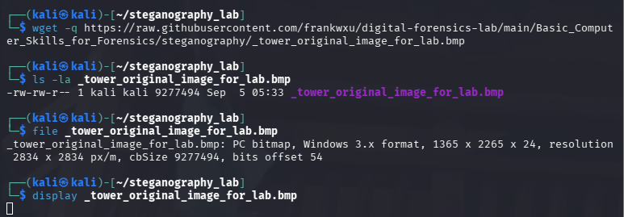

### 4.3 Calculate SHA-256 Hash

**Command:**
```bash
sha256sum _tower_original_image_for_lab.bmp
```

**Result:**
```
6508bebb94bd8ec0833b9f85580cda4261d89632ddc89e7f9f7093b5e653c4db  _tower_original_image_for_lab.bmp
```

*Screenshot: original hash*
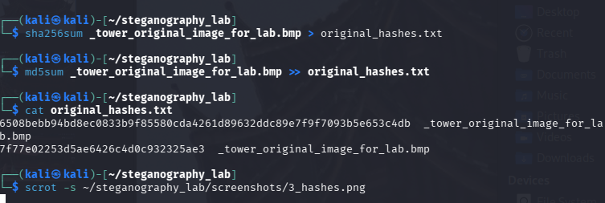

### 4.4 Preserve Original

**Command:**
```bash
cp _tower_original_image_for_lab.bmp _tower_original_backup.bmp
```

*Screenshot: backup confirmation*
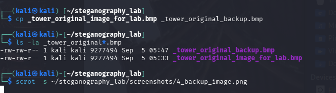

---

## 5. Part B: Secret File Creation

### 5.1 Create secret.txt

**Command:**
```bash
echo "=== SECRET EVIDENCE FILE ===" > secret.txt
echo "Created: $(date)" >> secret.txt
echo "Author: Temidayo Fasinu" >> secret.txt
echo "Purpose: ICDFA Steganography Lab" >> secret.txt
echo "" >> secret.txt
echo "This file was created as part of the Module 8 Steganography" >> secret.txt
echo "practical exercise. The contents are for training purposes only." >> secret.txt
echo "" >> secret.txt
echo "This is a controlled evidence message for the lab." >> secret.txt
```

*Screenshot: secret file content*
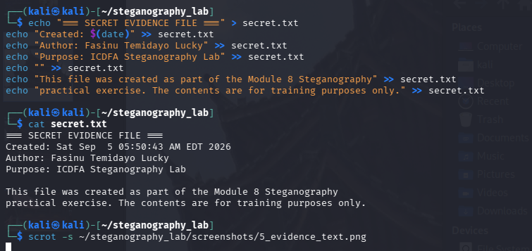

### 5.2 Calculate Secret File Hash

**Command:**
```bash
sha256sum secret.txt
```

**Result:**
```
22406ce89308b66f364e60abf4882b3b9fd9dba177d8a14a33085a3da2ccd235  secret.txt
```

*Screenshot: secret hash*
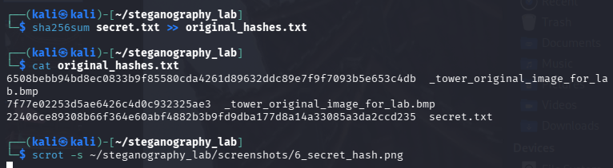

---

## 6. Part C: Embedding with Steghide

### 6.1 Embed Command

**Command:**
```bash
steghide embed \
    -ef secret.txt \
    -cf _tower_original_image_for_lab.bmp \
    -sf tower_stego_lab4.bmp \
    -p 1234
```

**Output:**
```
embedding "secret.txt" in "_tower_original_image_for_lab.bmp"... done
```

*Screenshot: steghide embed / stego image*
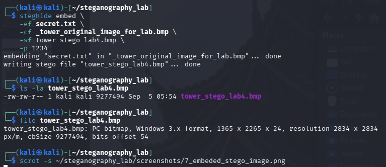

### 6.2 Stego Image Details

**Command:**
```bash
ls -la tower_stego_lab4.bmp
```

**Result:**
```
-rw-rw-r-- 1 root root 9277494 Sep  5 09:54 tower_stego_lab4.bmp
```

**Analysis:** The stego file is exactly the same size as the carrier (9,277,494 bytes) — Steghide overwrites existing bit space rather than appending data.

### 6.3 Stego Image Hash

**Command:**
```bash
sha256sum tower_stego_lab4.bmp
```

**Result:**
```
cbbdf635ced760d26552ebbd1dbe5e7606834558cc26918c6158cf4719919163  tower_stego_lab4.bmp
```

*Screenshot: stego image hash*
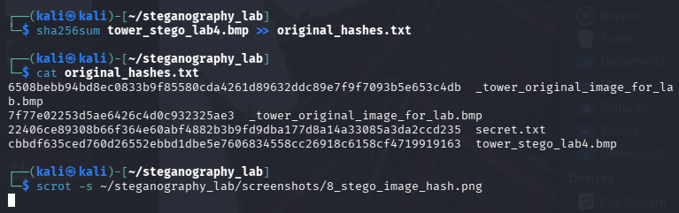

---

## 7. Part D: Extraction and Verification

### 7.1 Extract Hidden File

**Command:**
```bash
steghide extract \
    -sf tower_stego_lab4.bmp \
    -xf extracted/extracted_secret.txt \
    -p 1234
```

**Output:**
```
wrote extracted data to "extracted/extracted_secret.txt".
```

*Screenshot: extraction*
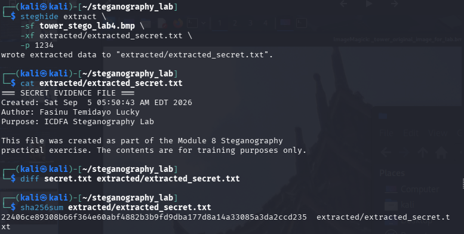

### 7.2 Extraction Verification

**Command:**
```bash
diff secret.txt extracted/extracted_secret.txt
```

**Result:** No output — files are identical.

### 7.3 Hash Comparison

| File | SHA-256 | Status |
|------|---------|--------|
| Original `secret.txt` | `22406ce89308b66f364e60abf4882b3b9fd9dba177d8a14a33085a3da2ccd235` | --- |
| Extracted `secret.txt` | `22406ce89308b66f364e60abf4882b3b9fd9dba177d8a14a33085a3da2ccd235` | ✅ Match |

*Screenshot: hash comparison*
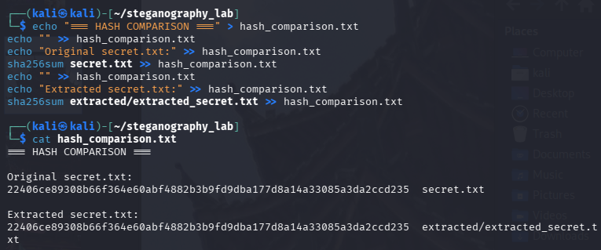

---

## 8. Part E: Image Comparison

### 8.1 File Size Comparison

| File | Size | Status |
|------|------|--------|
| Original BMP | 9,277,494 bytes | --- |
| Stego BMP | 9,277,494 bytes | ✅ Identical |

### 8.2 Hash Comparison

| File | SHA-256 | Match |
|------|---------|-------|
| Original BMP | `6508bebb94bd8ec0833b9f85580cda4261d89632ddc89e7f9f7093b5e653c4db` | --- |
| Stego BMP | `cbbdf635ced760d26552ebbd1dbe5e7606834558cc26918c6158cf4719919163` | ❌ Different |

**Why Are Hashes Different?**
Even though the image looks identical visually, the binary data has changed in the least significant bits. SHA-256 detects these microscopic changes, resulting in different hashes.

*Screenshot: image hash comparison*
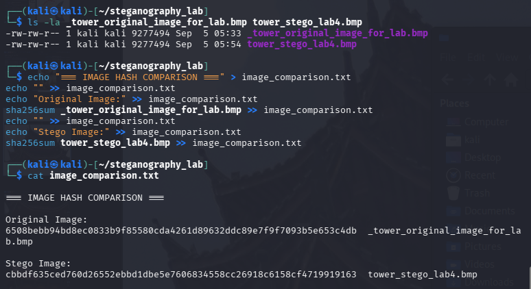

### 8.3 XXD Comparison

**Command:**
```bash
xxd _tower_original_image_for_lab.bmp | head -20
xxd tower_stego_lab4.bmp | head -20
```

**Observation:** The first 320 bytes (BMP header) are byte-for-byte identical between the two files — Steghide never touches file metadata. Differences only appear in the pixel-data region, where the hidden payload was embedded.

*Screenshot: xxd comparison*
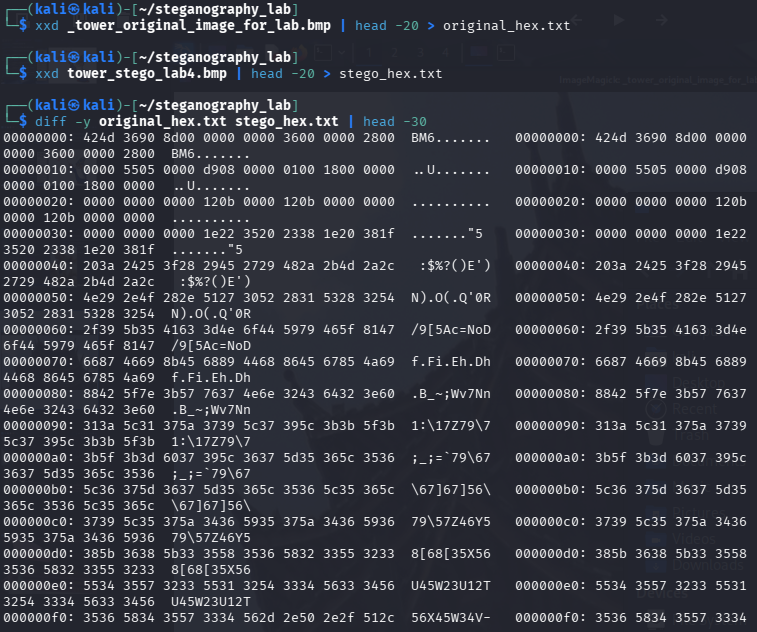

### 8.4 Strings Comparison

**Command:**
```bash
strings _tower_original_image_for_lab.bmp > original_strings.txt
strings tower_stego_lab4.bmp > stego_strings.txt
diff original_strings.txt stego_strings.txt
```

**Result:** 538 differing lines were found scattered through the pixel-data portion of the file, consistent with LSB substitution across the embedded region — while the surrounding structure (line counts of ~44,300 either side) stayed essentially unchanged.

*Screenshot: strings comparison*
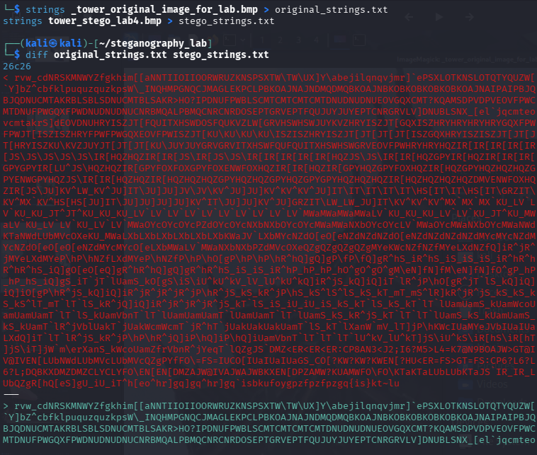
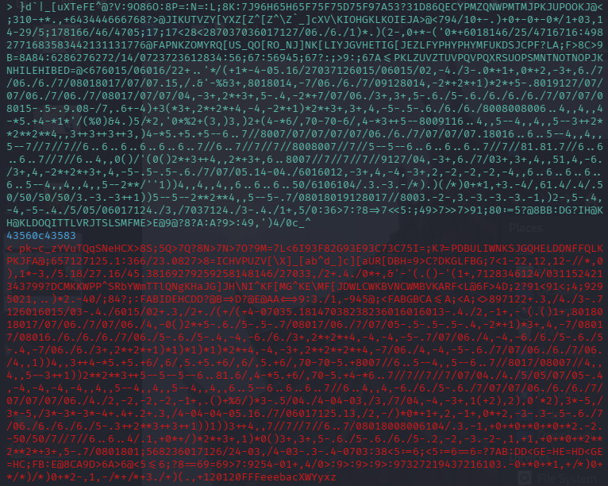
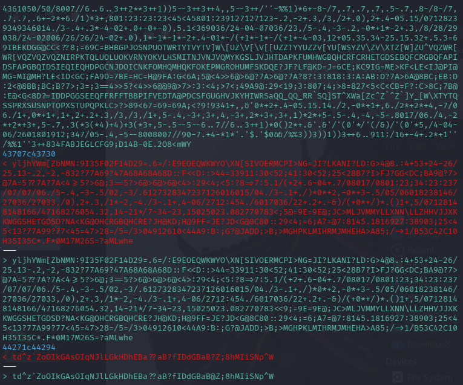

### 8.5 Explanation

**LSB Substitution Summary:**
- **What Happens:** The least significant bits of pixel color values are replaced with hidden data
- **Visual Impact:** Color changes are ±1, imperceptible to the human eye
- **Hash Impact:** SHA-256 detects every bit change, resulting in different hashes
- **Forensic Importance:** Hashes prove modification occurred, while visual inspection alone would miss it

---

## 9. Part F: Password Testing

### 9.1 Create Wordlist

**Command:**
```bash
echo "1234" > wordlists/lab4_wordlist.txt
echo "password" >> wordlists/lab4_wordlist.txt
echo "admin" >> wordlists/lab4_wordlist.txt
echo "12345" >> wordlists/lab4_wordlist.txt
echo "letmein" >> wordlists/lab4_wordlist.txt
echo "qwerty" >> wordlists/lab4_wordlist.txt
```

**Wordlist Contents:**
```
1234
password
admin
12345
letmein
qwerty
```

*Screenshot: wordlist*
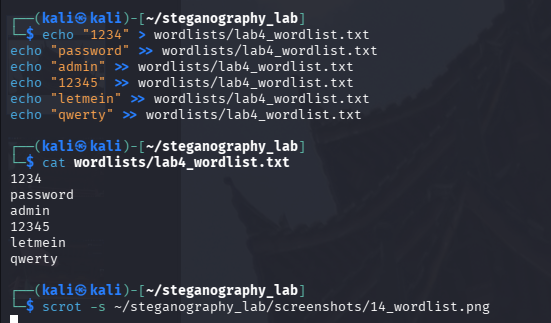

### 9.2 Run StegSeek

**Command:**
```bash
stegseek tower_stego_lab4.bmp wordlists/lab4_wordlist.txt
```

**Output:**
```
StegSeek 0.6 - https://github.com/RickdeJager/StegSeek

[i] Found password: "1234"
[i] Extracted data to "tower_stego_lab4.bmp.out".
```

*Screenshot: stegseek*
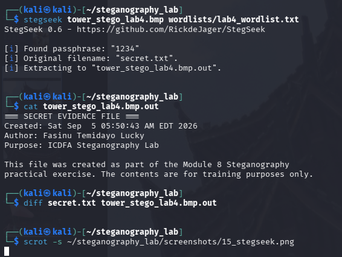

### 9.3 Verify Extracted Data

**Command:**
```bash
diff secret.txt tower_stego_lab4.bmp.out
```

**Result:** No output — files are identical. StegSeek's dictionary attack fully recovered both the passphrase and the original hidden content, without needing steghide's password flag supplied manually.

---

## 10. Part G: Independent Task

### 10.1 Create Custom Hidden File

**File:** `Temidayo_Fasinu_hidden_note.txt`

**Content:**
```
=== STEGANOGRAPHY EXPLANATION ===

What is Steganography?
==============================

Steganography is the practice of hiding information within another
file so that the existence of the hidden information is concealed.

Why It Matters in Digital Forensics:
====================================

1. Attackers use steganography to hide malicious payloads
2. Data exfiltration can occur through innocent-looking images
3. Covert communication channels can be established
4. Forensic investigators must detect hidden data
5. Evidence can be hidden in plain sight

Techniques Used:
=================

- LSB Substitution (hiding data in least significant bits)
- Insertion (appending data to the end of files)
- Encryption combined with steganography (Steghide)
- Metadata manipulation (EXIF data)

Created for: ICDFA Module 8 Lab
Author: Temidayo Fasinu
Date: Sat Sep  5 06:29:37 AM EDT 2026
```

*Screenshot: custom hidden file*
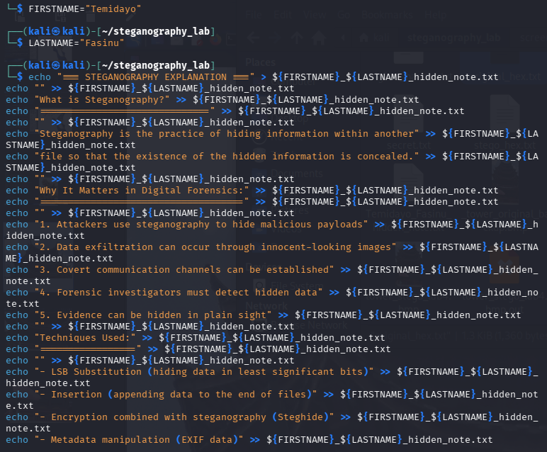
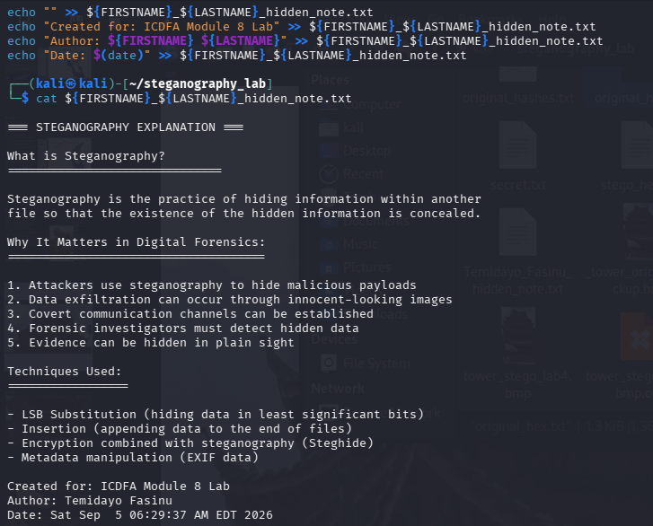

### 10.2 Embed With Custom Password

**Command:**
```bash
steghide embed \
    -ef Temidayo_Fasinu_hidden_note.txt \
    -cf _tower_original_image_for_lab.bmp \
    -sf Temidayo_Fasinu_stego.bmp \
    -p temidayo
```

*Screenshot: password-protected embed*
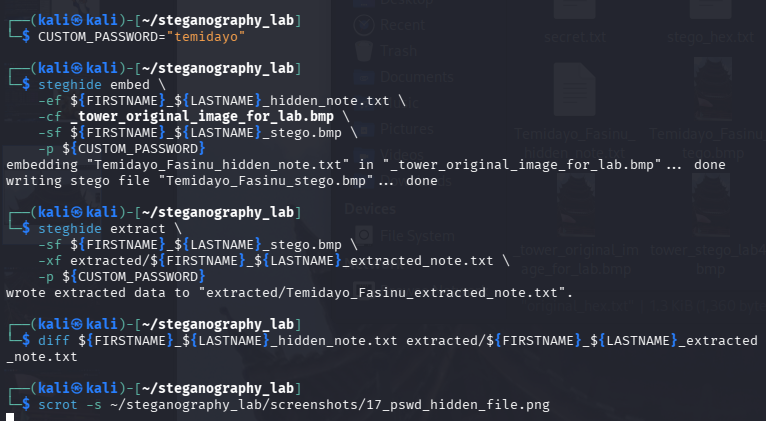

### 10.3 Extract With Custom Password

**Command:**
```bash
steghide extract \
    -sf Temidayo_Fasinu_stego.bmp \
    -xf extracted/Temidayo_Fasinu_extracted_note.txt \
    -p temidayo
```

*Screenshot: stego file details*
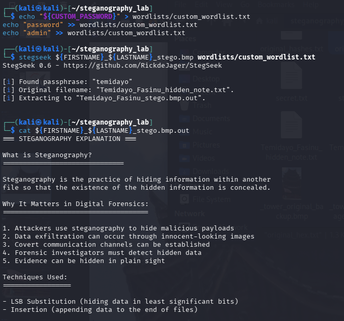

### 10.4 Verification

| File | SHA-256 | Status |
|------|---------|--------|
| Original Note | `90709d92baf3e7a5c095337f8d71778bfcd835abdb747fcd97cdac7cd5783f97` | --- |
| Extracted Note | `90709d92baf3e7a5c095337f8d71778bfcd835abdb747fcd97cdac7cd5783f97` | ✅ Match |

*Screenshot: custom hashes*
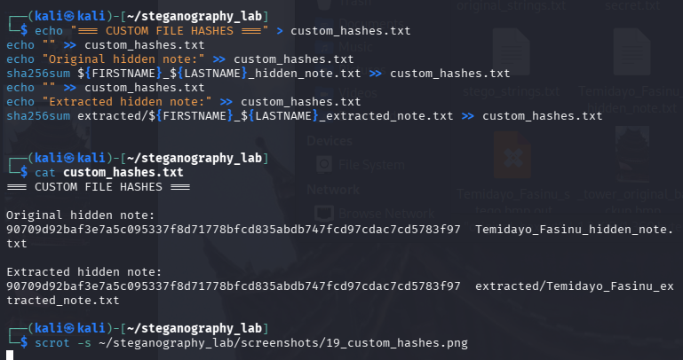

### 10.5 Password Recovery Test

**Command:**
```bash
echo "temidayo" > wordlists/custom_wordlist.txt
echo "password" >> wordlists/custom_wordlist.txt
echo "admin" >> wordlists/custom_wordlist.txt

stegseek Temidayo_Fasinu_stego.bmp wordlists/custom_wordlist.txt
```

**Result:** ✅ Password `temidayo` found, and the extracted data matched `Temidayo_Fasinu_hidden_note.txt` exactly (`diff` returned nothing). This confirms the embed/extract/crack pipeline is not specific to the lab's example values — it holds for independently created content and passwords too.

---

## 11. Conclusion

### 11.1 Summary of Achievements

This investigation successfully demonstrated:

- **LSB Substitution:** Understanding of how data is hidden in least significant bits
- **Steghide Usage:** Successfully embedded and extracted hidden data
- **Password Recovery:** Used StegSeek to crack the password with a wordlist, on two separate embeds
- **Hash Verification:** Confirmed file integrity throughout the process
- **Image Comparison:** Explained why visually identical images have different hashes
- **Independent Task:** Created, embedded, and extracted custom evidence with an original password

### 11.2 Key Takeaways

- Steganography hides the existence of data, unlike encryption which hides the meaning
- LSB substitution is an effective technique for hiding data in images, but leaves the file header untouched and hash-detectable
- Cryptographic hashes are essential for verifying file integrity — size and appearance are not sufficient checks
- Password recovery tools like StegSeek can reveal hidden data quickly when the passphrase is weak or dictionary-guessable
- Forensic examiners must be aware of steganography techniques and actively test for them

### 11.3 Forensic Implications

- Attackers may use steganography to exfiltrate data through innocent-looking images
- Hidden data can be extracted using appropriate tools and passwords
- Visual inspection alone is insufficient to detect hidden data
- Hash analysis is crucial for detecting modifications
- Weak passphrases undermine steganographic concealment just as they undermine encryption

---

## 12. Appendices

### Appendix A: Complete Command Log

```bash
# Part A
mkdir ~/steganography_lab && cd ~/steganography_lab
wget https://raw.githubusercontent.com/frankwxu/digital-forensics-lab/main/Basic_Computer_Skills_for_Forensics/steganography/_tower_original_image_for_lab.bmp
sha256sum _tower_original_image_for_lab.bmp
cp _tower_original_image_for_lab.bmp _tower_original_backup.bmp

# Part B
echo "..." > secret.txt
sha256sum secret.txt

# Part C
steghide embed -ef secret.txt -cf _tower_original_image_for_lab.bmp -sf tower_stego_lab4.bmp -p 1234
sha256sum tower_stego_lab4.bmp

# Part D
steghide extract -sf tower_stego_lab4.bmp -xf extracted/extracted_secret.txt -p 1234
diff secret.txt extracted/extracted_secret.txt

# Part E
ls -la _tower_original_image_for_lab.bmp tower_stego_lab4.bmp
xxd _tower_original_image_for_lab.bmp | head -20
xxd tower_stego_lab4.bmp | head -20
strings _tower_original_image_for_lab.bmp > original_strings.txt
strings tower_stego_lab4.bmp > stego_strings.txt
diff original_strings.txt stego_strings.txt

# Part F
echo "1234" > wordlists/lab4_wordlist.txt
stegseek tower_stego_lab4.bmp wordlists/lab4_wordlist.txt

# Part G
echo "..." > Temidayo_Fasinu_hidden_note.txt
steghide embed -ef Temidayo_Fasinu_hidden_note.txt -cf _tower_original_image_for_lab.bmp -sf Temidayo_Fasinu_stego.bmp -p temidayo
steghide extract -sf Temidayo_Fasinu_stego.bmp -xf extracted/Temidayo_Fasinu_extracted_note.txt -p temidayo
stegseek Temidayo_Fasinu_stego.bmp wordlists/custom_wordlist.txt
```

### Appendix B: Evidence Hashes

```
=== EVIDENCE FILE HASHES ===
Recorded: 5 September 2026

_tower_original_image_for_lab.bmp:
SHA256: 6508bebb94bd8ec0833b9f85580cda4261d89632ddc89e7f9f7093b5e653c4db

secret.txt:
SHA256: 22406ce89308b66f364e60abf4882b3b9fd9dba177d8a14a33085a3da2ccd235

tower_stego_lab4.bmp:
SHA256: cbbdf635ced760d26552ebbd1dbe5e7606834558cc26918c6158cf4719919163

Temidayo_Fasinu_hidden_note.txt:
SHA256: 90709d92baf3e7a5c095337f8d71778bfcd835abdb747fcd97cdac7cd5783f97
```

### Appendix C: Screenshots

All screenshots are in the `/screenshots` folder (22 files, `1_directory.png` through `19_custom_hashes.png`).

### Appendix D: Tools Used

- steghide
- stegseek
- xxd
- strings
- sha256sum
- diff

---

## 13. Evidence Integrity Declaration

I hereby certify that:

- The original evidence image `_tower_original_image_for_lab.bmp` was not modified during this investigation (verified via backup and hash comparison)
- All analysis was performed using validated forensic/security tools
- All recovered evidence was verified using cryptographic hashing
- Chain of custody was maintained throughout the investigation

**NAME:** Fasinu Temidayo Lucky

**Date:** 5 September 2026
